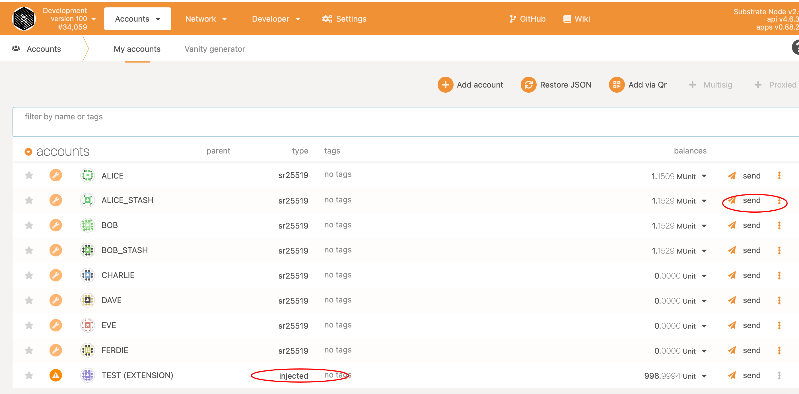
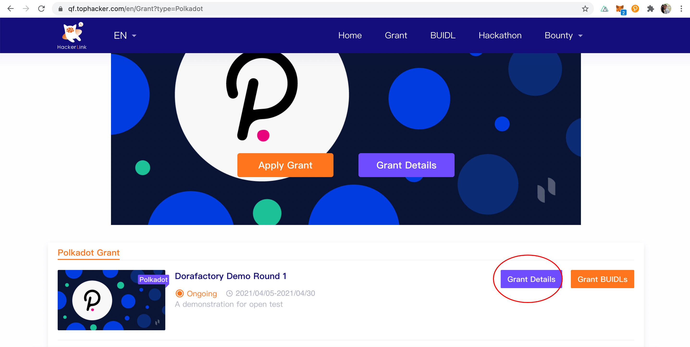
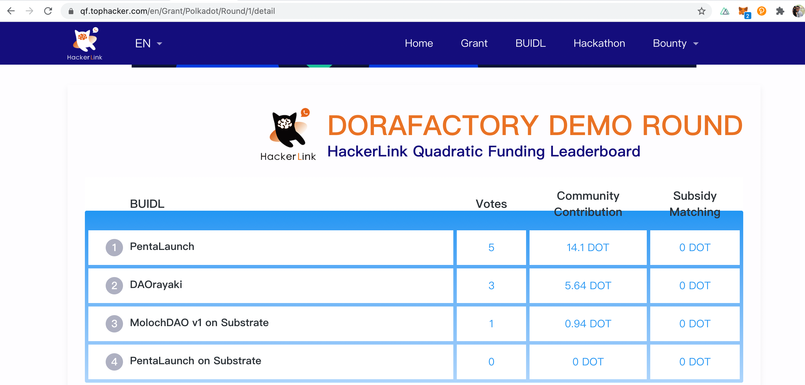
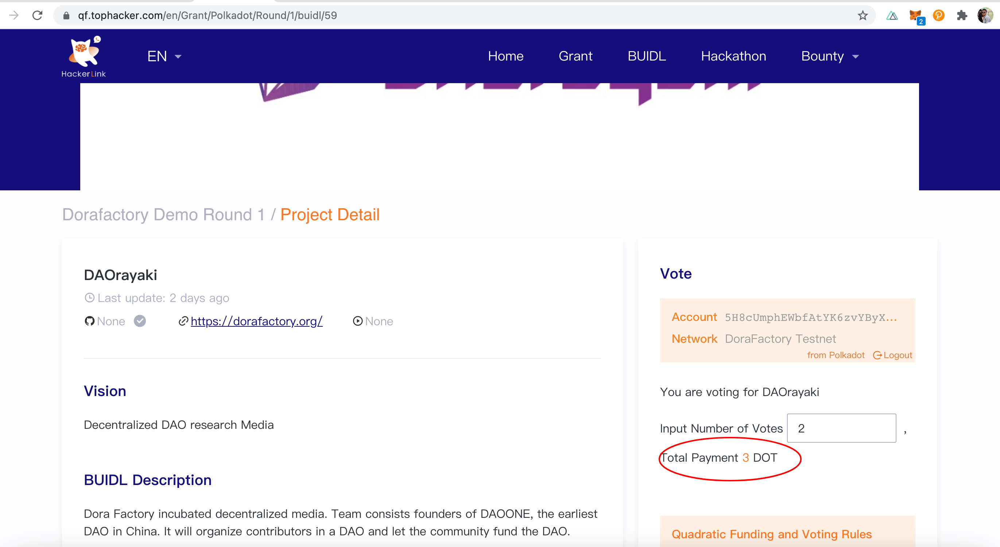
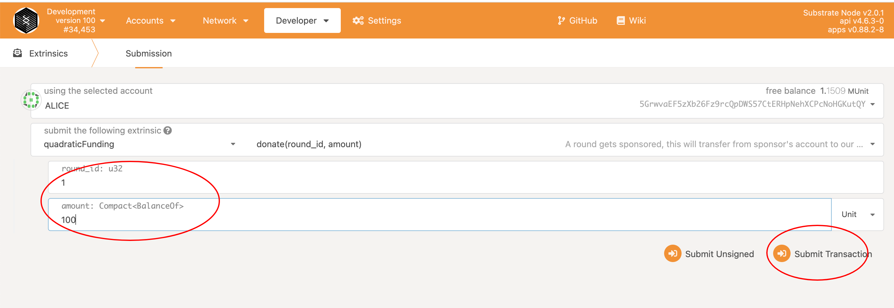

### Introduction
This document is for milestone-2, which demonstrates a complete flow of quadratic funding pallet based on substrate. We have deployed our pallet to a private chain, you can access the chain info [here](https://polkadot.js.org/apps/?rpc=wss%3A%2F%2Fdao.tophacker.com#/explorer)  
We have integrated the functions with our own [website](https://qf.tophacker.com/en/Grant?type=Polkadot). To reduce your testing steps, we have set up the round and uploaded some demo projects in advance.

### Prerequisites
1. Modern web browsers installed, Chrome/Firefox recommended
2. Install polkadot js extension for your browser https://polkadot.js.org/extension/
3. Use the extension to create new account and allow to use on any chain

### Test
1. Navigate to https://polkadot.js.org/apps/?rpc=wss%3A%2F%2Fdao.tophacker.com#/explorer, you'll see our private chain info. 
2. Click the `Accounts` tab, use Alice/Bob to transfer some balances to your own account, which should be listed with "injected" type on the bottom.

3. Go back to our own site, https://qf.tophacker.com/en/Grant?type=Polkadot, click the `Grant Details` button, you'll see a bunch of registered projects and an almost real-time ranking chart.
```
Notice:  
For security concern, we have disabled refresh and direct navigation of project details, if you encountered some errors, just open the previous link and click buttons to navigate.
```  

  
4. Choose any project you want to vote, and input the ballots you want. You'll see an estimated cost when changing the number of ballot, just make sure your balance is enough.  

5. Click the breadcrumbs and navigate back to the project list(ie. Grant details), check the ranking. Or you can just vote more than once for a project to see if the cost is applied to the quadratic voting rules.  
6. If you want to sponsor our round, just go back to https://polkadot.js.org/apps/?rpc=wss%3A%2F%2Fdao.tophacker.com#/explorer and send a donate extrinsic. After that you can check the ranking, should've updated correctly.

