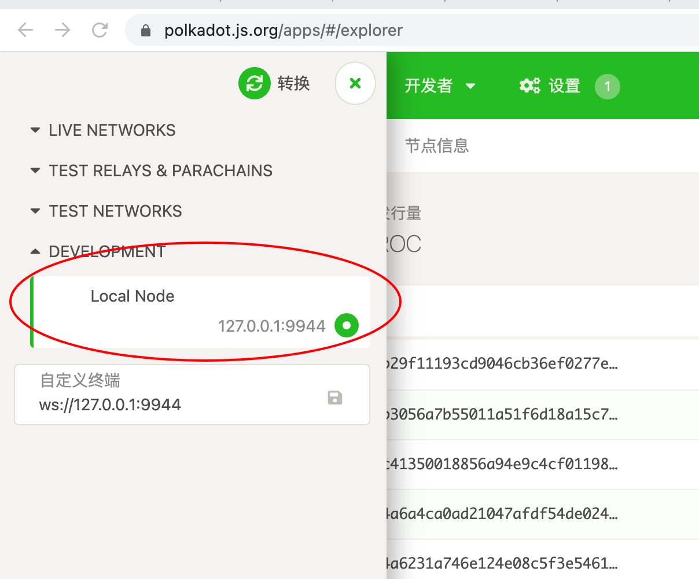
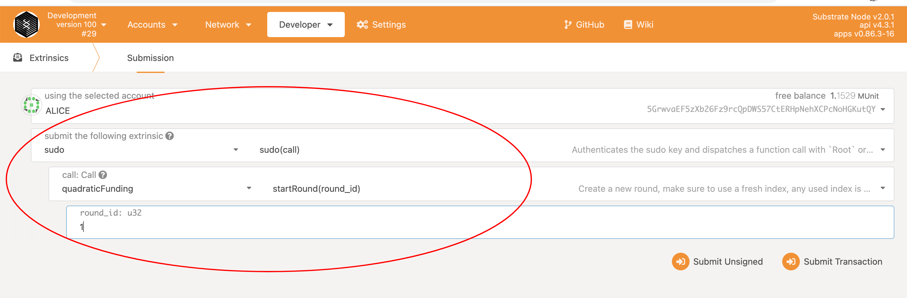
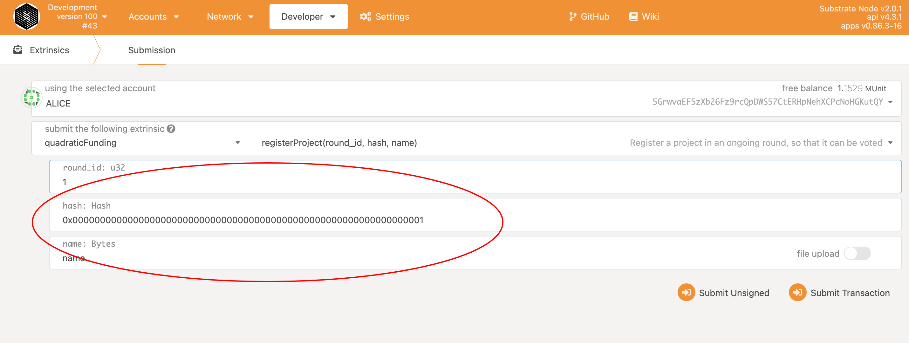
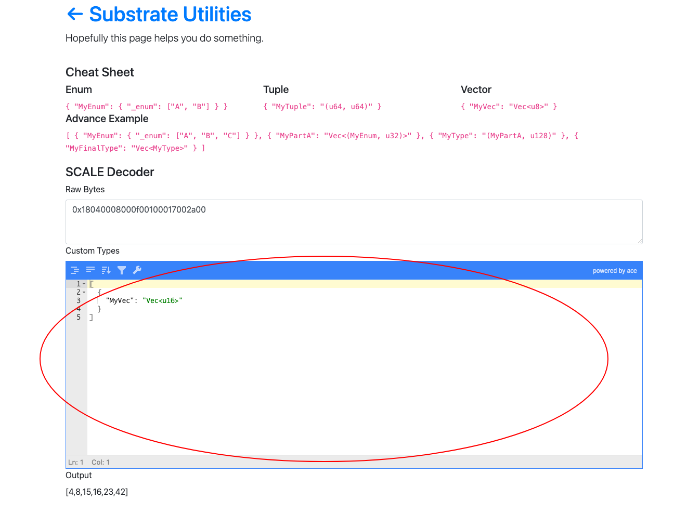
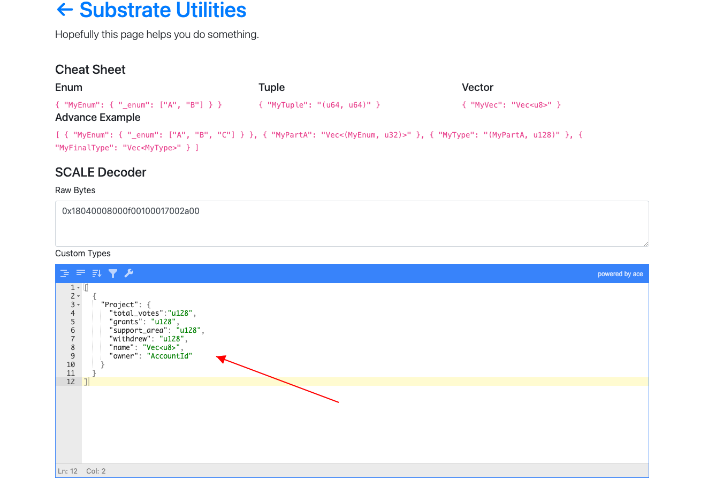
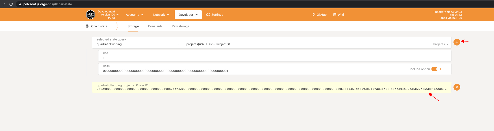
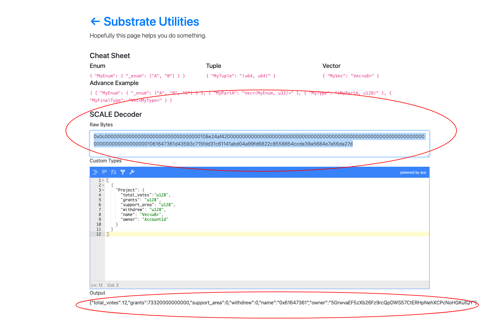

### Build
Run `cargo +nightly build --release`  
Then run `./target/release/node-template --dev`

### Test
1. Navigate to https://polkadot.js.org/apps/#/explorer
2. Click the lef top icon to open settings and choose the local node, just like below

3. Click the developer tab, choose Extrinsics, and then use Alice to start a new round

4. You can then run register_project or donate

5. After that, you can use any account with balance to vote and watch the changes
6. At last, following step 3, use Alice account with sudo to end the round, the projects will be reckoned with sponsored share

### Decode messages to json
As you may find that the result of chain state is a long hex string, which is not human readable. This is because substrate used [SCALE](https://substrate.dev/docs/en/knowledgebase/advanced/codec) to encode the json. The decode procedure is quite simple.
1. Open the online [decoder link](https://www.shawntabrizi.com/substrate-js-utilities/codec/), focus on the "custom types" input

2. Navigate to the [exmaple file](../pallets/quadratic-funding/src/example), you can see that we have defined the type definition of types which our storage will use, copy the corresponding types and paste it to the input you focused in previous step. Let's use project as a demonstration

3. Go backto polkadot js and use chain state to query the storage, paste the hex string to the raw bytes input, then you'll see the decoded result.

4. The name field is hex encoded string, if you want to check that too, you can use [this tool](https://codebeautify.org/hex-string-converter) to decode it.

